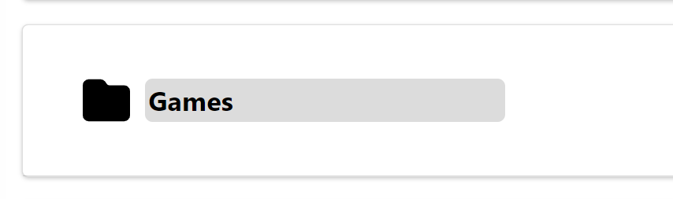
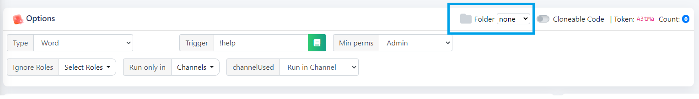
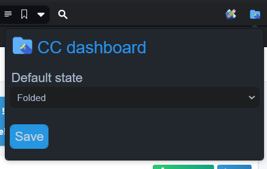

# CC folders
An extensions allowing you to organize your [Custom Command](https://ccbot.me/) commands with folders.
> 

# Usage
+ Once you log in to the dashboard, you will notice a `New folder` button.
Everytime you click it, an empty folder will be created.
> 

+ You can rename it by clicking it's name.
> 

+ Folders can be opened and closed by clicking the folder image

+ Every command received a menu for folder selection.
Go to the command edit page to change the folder which it belongs to.
> 

+ You can define whether folders should be folder or unfolded on page load within a popup.
> 

+ All your settings are stored in your browsers, and won't be reset on leave.

# Installation
## Chrome
1. Download the zip file from [cc-dash.zip](cc-dash.zip?raw=1)
2. Open extensions tab in your browser
3. Enable developer mode (top right corner)
4. Drag in the zip file

**Note:** Don't worry if the `errors` tab appears, it will be displayed because you are in the developer mode.

## Firefox
1. Go to the firefox addons store [extension's page](https://addons.mozilla.org/en-US/firefox/addon/cc-dashboard-folders/)
2. Download the extension

# Support
If you struggle with making the extension work, feel free to reach out to `fajfaj#6941` in the [CC support server](https:/ccbot.me/join).

# Custom command
[Custom Command](https://ccbot.me/) is a separate project which I am not a creator of. 
All of the credits for cc belong to it's actual owner.